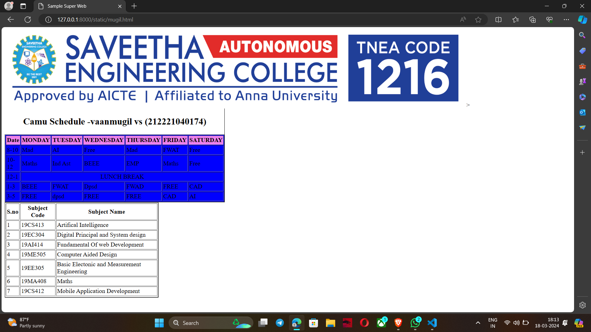

# Ex03 Time Table
## Date:17-3-24

## AIM
To write a html webpage page to display your slot timetable.

## ALGORITHM
### STEP 1
Create a Django-admin Interface.

### STEP 2
Create a static folder and inert HTML code.

### STEP 3
Create a simple table using ```<table>``` tag in html.

### STEP 4
Add header row using ```<th>``` tag.

### STEP 5
Add your timetable using ```<td>``` tag.

### STEP 6
Execute the program using runserver command.

## PROGRAM
```

<head>
<title> Sample Super  Web</title>
</head>
<table border ="2" cellpadding="2" width="400" heigth="400" bgcolor="blue">

<caption> <h2>Camu Schedule </h2></caption>

<tr <tr bgcolor="violet">>


<th>Date</th>
<th>MONDAY</th>
<th>TUESDAY</th>
<th>WEDNESDAY</th>
<th>THURSDAY</th>
<th>FRIDAY</th>
<th>SATURDAY</th>


</tr>
<tr>
<td>8-10</td>
<td>Mad</td>
<td>AI</td>
<td>Free</td>
<td>Mad</td>
<td>FWAT</td>
<td>Free</td>

</tr>
<tr>
<td>10-12</td>
<td>Maths</td>
<td>Ind Ast</td>
<td>BEEE</td>

<td>EMP</td>
<td>Maths</td>
<td>Free</td>

</tr>
<tr>

<td>12-1</td>

<td colspan="6" align="center"> LUNCH BREAK</td>


</tr>

<tr>

<td>1-3</td>
<td>BEEE</td>
<td>FWAT</td>
<td>Dpsd</td>
<td>FWAD</td>
<td> FREE</td>
<td>CAD</td>

</tr>
<tr>
<td>3-5</td>
<td>FREE</td>
<td>dpsd</td>
<td>FREE</td>
<td>FREE</td>

<td>CAD</td>
<td>AI</td>
</tr>


</table>
<table border ="2" cellpadding="2" width="400" heigth="400" >
<tr>
<th>S.no</th>
<th>Subject Code</th>
<th>Subject Name</th>
</tr>
<tr>
<td>1</td>
<td>19CS413</td>
<td>Artifical Intelligence</td>
</tr>
<tr>
<td>2</td>
<td>19EC304</td>
<td>Digital Principal and System design</td>
</tr>
<tr>
<td>3</td>
<td>19AI414</td>
<td>Fundamental Of web Development</td>
</tr>
<tr>
<td>4</td>
<td>19ME505</td>
<td>Computer Aided Design</td>
</tr>
<tr>
<td>5</td>
<td>19EE305</td>
<td>Basic Electonic and Measurement Engineering</td></tr>
<tr>
<td>6</td>
<td>19MA408</td>
<td>Maths</td>
</tr>
<tr>
<td>7</td>
<td>19CS412</td>
<td>Mobile Application Development</td></tr>
<tr>
</table>
</body>
</html>
```
## OUTPUT



## RESULT
The program for creating slot timetable using basic HTML tags is executed successfully.
